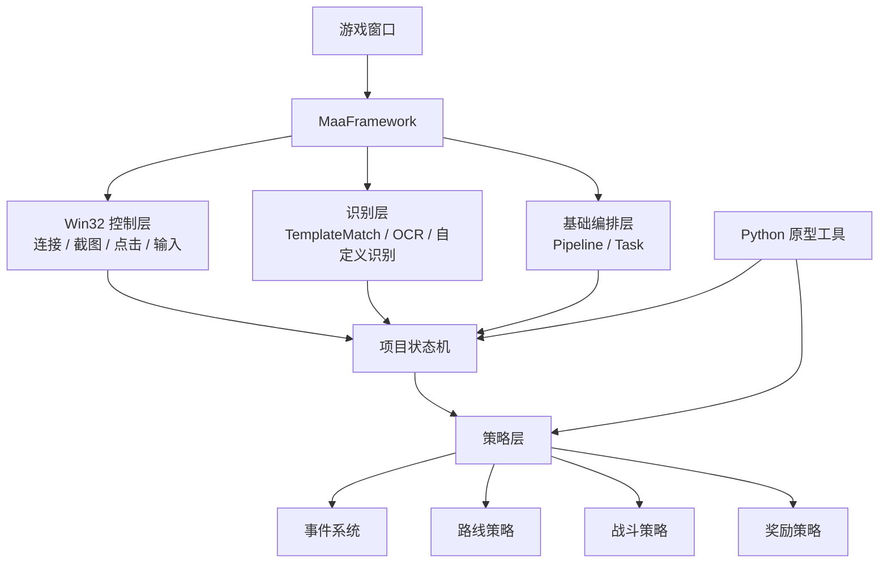

# 系统架构说明

最后更新：2026-06-09

## 1. 目标

本文档用于说明 `卡厄思梦境 PC 自动化项目` 的整体技术分层，以及 `MaaFramework` 在整个系统中的位置。

同时回答一个关键问题：

- 后续肉鸽事件、路线、战斗这部分逻辑，是否会重新写到 `MaaFramework` 基座上？

答案是：

- `会`
- 但不是立刻推翻当前 Python 原型
- 而是采用“先用 Python 原型验证，再逐步迁到 MaaFramework 主链路”的方式推进

## 2. 总体分层

项目推荐采用四层结构。

### 2.1 控制层

负责：

- 连接游戏窗口
- 截图
- 点击
- 键盘输入
- 等待窗口状态变化

这部分在正式方案中，优先由 `MaaFramework + Win32 Controller` 承担。

### 2.2 识别层

负责：

- 模板匹配
- OCR
- 界面识别
- 按钮识别
- 文本提取

这部分在正式方案中，优先由 `MaaFramework Recognition` 承担，包括：

- `TemplateMatch`
- `OCR`
- 必要时的自定义识别器

### 2.3 状态机层

负责：

- 判断当前在哪个页面
- 管理页面流转
- 管理等待、超时、重试
- 决定何时进入事件处理、路线选择、战斗逻辑

这部分相当于流程骨架。

### 2.4 策略层

负责：

- 事件选项选择
- 地图路线选择
- 奖励选择
- 战斗出牌决策

这部分才是项目真正的“业务大脑”。

## 3. MaaFramework 在系统中的位置

`MaaFramework` 的主要作用不是替我们决定“怎么选事件、怎么打牌”，而是承接下面这些基础能力：

- 控制层
- 识别层
- Pipeline / 基础任务编排
- 自定义 Recognition / Action 扩展接口

可以把它理解成：

- `MaaFramework = 自动化运行时和底盘`
- `我们的状态机和策略模块 = 游戏业务逻辑`

## 4. 当前 Python 原型的作用

当前仓库里的 Python 代码，主要承担的是原型验证和规则迭代工作。

它当前已经证明了这些事情：

- 可以连接 `卡厄思梦境` PC 窗口
- 可以稳定截图
- 可以稳定点击
- 可以完成 `主界面 -> 卡厄思 -> 零式系统 -> 法典 -> 配队 -> 肉鸽入口`
- 可以开始独立验证事件页检测

所以这套 Python 原型不是“无效的临时代码”，而是：

- 验证游戏交互特征
- 沉淀模板资源
- 沉淀状态机拆法
- 沉淀事件与策略规则

## 5. 后续是否会重新写

### 5.1 会迁移的部分

后续正式主流程中，下面这些部分建议逐步迁到 `MaaFramework` 上：

- 窗口控制
- 标准模板匹配
- OCR 调用
- 页面流程编排
- 主状态机执行主链路

### 5.2 不会被丢掉的部分

当前 Python 原型里的这些成果不会浪费：

- 模板资源
- 页面识别经验
- 状态拆分方式
- 事件规则表
- 战斗策略规则
- 调试截图和日志经验

它们会成为后续 MaaFramework 版本的输入。

### 5.3 更准确的说法

因此后续不是“全部推倒重写”，而是：

- `底层承载方式逐步迁移到 MaaFramework`
- `上层业务规则与策略继续延续`

## 6. 推荐迁移方式

建议分两阶段推进。

### 阶段 A：继续用 Python 原型验证业务逻辑

目标：

- 把肉鸽事件、地图、战斗等逻辑先验证清楚

适合继续放在 Python 原型中的内容：

- 独立事件检测工具
- 规则试验
- 调试脚本
- OCR 可行性验证

### 阶段 B：把稳定能力迁到 MaaFramework 主链路

目标：

- 形成正式的主运行方案

优先迁移顺序建议：

1. 页面导航主链路
2. OCR / 文本识别
3. 事件页处理
4. 地图页路线选择
5. 战斗策略

## 7. 推荐的最终关系

可以把未来的项目结构理解成：

- `MaaFramework`
  - 负责运行时、控制、识别、基础编排
- `项目自定义模块`
  - 负责状态机扩展、事件系统、路线策略、战斗策略
- `Python 原型工具`
  - 负责调试、快速验证、离线分析

## 8. 架构图

## 9. 当前结论

后续肉鸽这块逻辑，长期看会逐步迁到 `MaaFramework` 基座上。

但策略上不建议现在就强行整体切换，而应保持：

- `Python 原型继续验证业务逻辑`
- `MaaFramework 作为正式主链路的目标底盘`

这样做的好处是：

- 当前开发速度不会被过早框架迁移拖慢
- 已验证的规则不会丢
- 后续进入正式阶段时，迁移路径也更清楚
