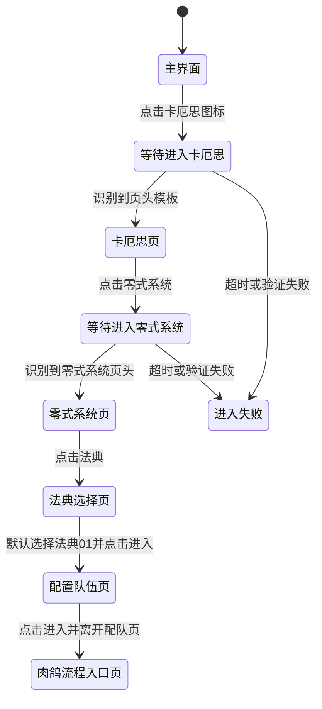
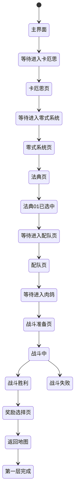

# 状态机设计说明

最后更新：2026-06-09

## 1. 目标

本文档用于定义 `卡厄思梦境 PC 自动化项目` 的状态机设计思路，并说明：

- 什么是状态机
- 为什么过关流程必须使用状态机
- 当前已经实现了哪些状态
- 后续第一层过关流程应如何拆分状态

## 2. 什么是状态机

在本项目里，状态机可以简单理解为：

- 程序先判断“自己当前在哪个页面或阶段”
- 再根据当前状态决定“下一步应该做什么”
- 动作执行后，再判断“是否进入了新的状态”

也就是说，自动化程序不是按一条固定点击脚本盲目执行，而是始终围绕下面三个问题工作：

1. 当前状态是什么
2. 当前状态下允许执行什么动作
3. 执行动作后应该转移到什么状态

## 3. 为什么需要状态机

如果没有状态机，自动化流程通常会退化成：

- 先点这里
- 再点那里
- 等一会儿
- 再点下一步

这种方式的问题是：

- 页面切换慢时容易点早
- 弹窗出现时容易点错
- 加载中页面会打断既定顺序
- 同一个按钮在不同页面含义可能不同
- 一旦流程偏离预期，程序没有恢复能力

而状态机的价值在于：

- 每一步都先确认当前页面再动作
- 能区分“等待中”“已成功”“失败”“异常弹窗”等不同情况
- 能为每个状态定义单独的重试与超时策略
- 能逐步扩展成完整过关流程，而不是堆积硬编码点击脚本

## 4. 状态机与识别/点击的关系

状态机本身不负责图像识别和点击，它负责“编排”。

可以把系统分成三层理解：

### 4.1 控制层

负责：

- 连接窗口
- 截图
- 点击
- 键盘输入

### 4.2 识别层

负责：

- 判断当前界面
- 找按钮、图标、标题、弹窗
- 判断加载完成与否

### 4.3 状态机层

负责：

- 根据识别结果决定当前状态
- 选择当前状态下的动作
- 管理状态跳转、超时、重试与兜底

所以状态机不是替代识别和输入，而是把它们组织成一个可维护的流程系统。

## 5. 当前已实现的状态片段

虽然当前代码里还没有正式抽成状态机类，但逻辑上已经实现了一个最小状态机片段。

### 5.1 主界面

识别依据：

- 右侧导航区域内存在 `卡厄思 + 星球` 图标模板

动作：

- 点击 `卡厄思` 图标

下一状态：

- `等待进入卡厄思`

### 5.2 等待进入卡厄思

识别依据：

- 点击后轮询截图
- 在左上角区域查找 `返回按钮 + 卡厄思标题` 模板

动作：

- 不继续乱点
- 持续轮询直到目标页面出现或超时

下一状态：

- 成功时进入 `卡厄思页`
- 超时时进入 `进入失败`

### 5.3 卡厄思页

识别依据：

- 已识别到 `返回按钮 + 卡厄思标题`

动作：

- 当前已实现识别并点击 `零式系统` 入口

下一状态：

- `等待进入零式系统`

### 5.4 等待进入零式系统

识别依据：

- 点击 `零式系统` 后轮询截图
- 在左上角区域查找 `返回按钮 + 零式系统标题` 模板

动作：

- 不继续乱点
- 持续轮询直到目标页面出现或超时

下一状态：

- 成功时进入 `零式系统页`
- 超时时进入 `进入失败`

### 5.5 零式系统页

识别依据：

- 已识别到 `返回按钮 + 零式系统标题`

动作：

- 当前已实现从该页继续进入“法典 -> 法典01 -> 配队 -> 进入肉鸽前跳转”

下一状态：

- `法典选择页`

### 5.6 法典选择页

识别依据：

- `零式系统` 页右侧 `法典` 按钮模板
- 点击后轮询出现 `法典01` 选项模板

动作：

- 点击 `法典`
- 默认选择 `01` 号法典
- 点击法典页 `进入`

下一状态：

- `配置队伍页`

### 5.7 配置队伍页

识别依据：

- 左上角 `返回按钮 + 配置队伍标题` 模板

动作：

- 点击右下角 `进入`
- 轮询等待肉鸽入口界面模板出现

下一状态：

- `肉鸽流程入口页`

## 6. 当前闭环的状态转移图

可以用下面这条简单流程理解现状：

## 7. 当前已确认的第一层主线

根据当前整理出的游戏流程，默认主线应按下面的顺序推进：

1. 主界面
2. 卡厄思页
3. 零式系统页
4. 点击 `法典`
5. 在 `01 / 02 / 03` 三个法典位中默认选择 `01`
6. 点击 `进入`
7. 进入配置队伍页面
8. 再点击 `进入`
9. 进入肉鸽流程

当前代码已经按这条主线继续扩展到：

- `法典按钮识别/点击`
- `法典页等待`
- `法典01识别/点击`
- `法典页进入按钮识别/点击`
- `配置队伍页等待`
- `配置队伍页进入按钮识别/点击`
- `离开配置队伍页验证`

## 8. 后续第一层过关流程建议状态

如果后续目标是完成“第一层过关并领奖”，建议优先拆成以下状态。

### 7.1 外层导航状态

- `主界面`
- `等待进入卡厄思`
- `卡厄思页`
- `节点/模式选择页`
- `等待进入关卡`

### 7.2 战斗相关状态

- `战斗准备页`
- `战斗中`
- `等待战斗结束`
- `战斗胜利`
- `战斗失败`

### 7.3 结算与奖励状态

- `奖励选择页`
- `结算页`
- `返回地图`
- `第一层完成`

### 7.4 异常状态

- `加载中`
- `未知页面`
- `弹窗中断`
- `超时恢复`

## 9. 第一层过关的推荐主流程

后续可以把主流程设计为：

这条主流程只是理想路径，实际实现时还需要为每个节点挂上：

- 加载中判断
- 超时重试
- 页面异常恢复

## 10. 每个状态建议包含的信息

后续代码里的每个状态建议至少定义以下内容。

### 9.1 状态标识

- 状态名称
- 状态描述

### 9.2 识别条件

- 如何确认当前就在这个状态
- 使用哪些模板、OCR、颜色判断或按钮特征

### 9.3 动作定义

- 当前状态允许执行哪些动作
- 动作是否需要点击、等待、截图、滚动、确认弹窗

### 9.4 转移条件

- 动作成功后进入哪个状态
- 动作失败后进入哪个状态
- 超时后进入哪个状态

### 9.5 兜底策略

- 连续识别失败怎么办
- 页面不稳定怎么办
- 是否回退、重试、退出本轮

## 11. 当前阶段推荐的实现顺序

建议按下面顺序推进状态机，不要一上来就覆盖全部过关流程。

### 第一步

把当前已实现流程正式抽成状态机：

- `主界面`
- `等待进入卡厄思`
- `卡厄思页`
- `等待进入零式系统`
- `零式系统页`

### 第二步

补 `零式系统页` 内的业务主线：

- 识别并点击 `法典`
- 在 `01 / 02 / 03` 中默认选择 `01`
- 点击 `进入`
- 验证进入配队页

### 第三步

扩展为外层完整导航：

- 主界面到卡厄思
- 卡厄思到零式系统
- 零式系统到法典
- 法典到配队
- 配队到肉鸽入口

### 第四步

再进入战斗状态机：

- 战斗准备
- 出牌逻辑
- 结算与奖励

## 12. 当前阶段的设计原则

在正式进入完整过关流程前，状态机设计应遵守这些原则：

- 优先做少量高置信状态，不追求一次覆盖所有页面
- 每个状态的识别依据尽量稳定、可解释
- 每次状态转移都必须有日志
- 每个状态都必须有超时策略
- 状态命名优先按“页面/阶段语义”而不是“按钮名”

## 13. 与当前项目的关系

这份文档的目的不是一次性把所有状态都定死，而是建立一个共同框架：

- 让后续功能都以“状态”为单位扩展
- 让识别、点击、验证都围绕状态跳转组织
- 让过关流程自然演进为可维护的自动化系统

当前项目已经证明：

- `识别 -> 点击 -> 验证结果`

这条链路在 `卡厄思梦境 PC 客户端` 上是可行的。

后续真正把项目做成“自动过第一层”的关键，就是把这条链路不断扩展成多个连续状态，并加入重试、超时和恢复能力。
